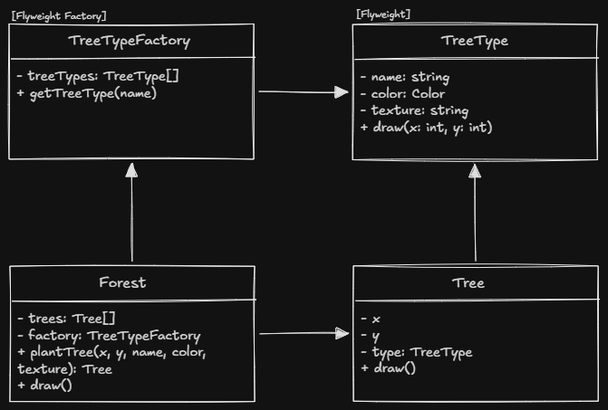

# Atividade Sobre Otimização de Memória com Padrão Flyweight
Realizada durante a disciplina de Projeto Orientado a Objetos, no curso de Ciência da Computação, na Universidade Federal de São Paulo (UNIFESP).

# Integrantes
- Daniel Monteiro Ribeiro
- João Vitor Moreira Gomes

# Descrição do Projeto
Este projeto implementa o padrão de design Flyweight para otimizar o uso de memória durante a criação de objetos de árvores um um jogo. O padrão Flyweight é utilizado para compartilhar objetos que possuem dados comuns, reduzindo a quantidade de memória necessária para criar múltiplas instâncias.

# Diagrama de Classes
